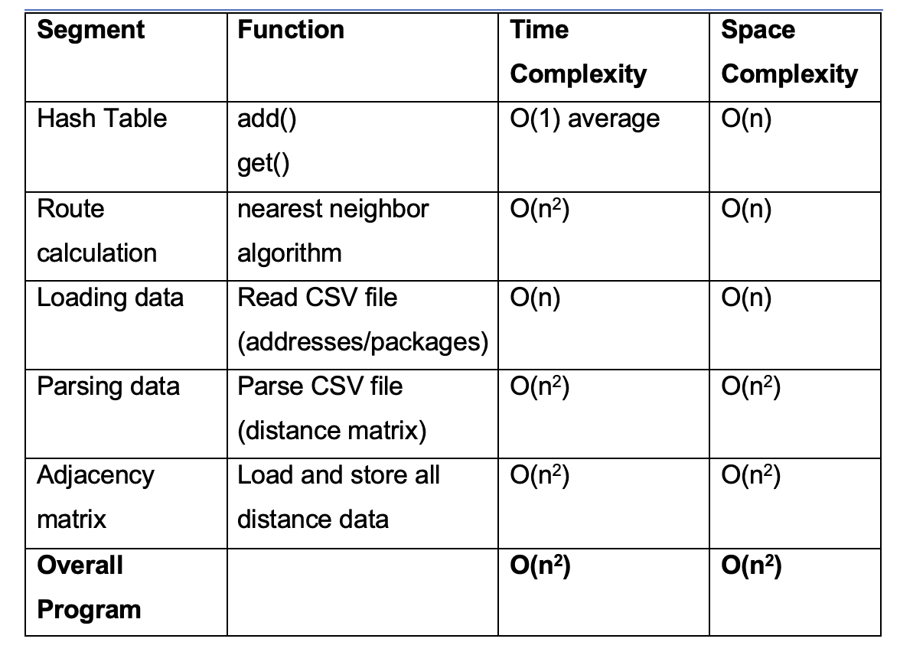

# Package Delivery Route Optimizer

A route optimization simulation using data structures and algorithms.

## Overview:

This project simulates a real-world package delivery system designed to optimize routes and ensure all deliveries are completed on time while minimizing total distance traveled.

The system models multiple delivery trucks, package constraints, and real-world logistics challenges using custom data structures and routing logic.

## Key Concepts & Skills:

- Custom **Hash Table implementation** for fast package lookup
- **Nearest Neighbor (Greedy) algorithm** for route optimization
- Time-based simulation of deliveries
- Handling real-world constraints (delays, grouped deliveries, address corrections)
- CSV data processing and parsing
- Object-Oriented Programming (OOP)

## Features

### View all packages at a specific time

- Displays:
  - Delivery status (At Hub, En Route, Delivered, Delayed)
  - Delivery time
  - Truck assignment
  - Special notes

### Look up a single package

- Input:
  - Time
  - Package ID
- Returns full package details and status

### Delivery simulation

- 3 trucks, 2 drivers
- All packages are delivered before their deadline while keeping total mileage under 140 miles
- Handles:
  - Delayed packages
  - Address corrections
  - Grouped deliveries
  - Truck constraints

### Mileage tracking

- Calculates total miles traveled across all trucks

## Algorithm & Design Decisions

### Routing Algorithm: Nearest Neighbor

This project uses a **nearest neighbor algorithm**, a greedy heuristic for solving routing problems.

At each step, the system:

1. Starts at the hub
2. Selects the closest undelivered package
3. Travels to that location
4. Repeats until all deliveries are complete

The nearest neighbor algorithm is **self-adjusting** because it dynamically selects the next delivery based on the current position and remaining undelivered packages.

### Why I chose this algorithm:

- Simple and efficient
- Minimizes distance at each step
- Easy to maintain and scale
- Adapts to real-time constraints

While not perfectly optimal, it provides a strong balance between performance and simplicity.

## Time & Space Complexity



## Data Structure: Hash Table

A custom hash table is used to store package data.

- **Key**: package ID (unique)
- **Value:** package object

### Benefits:

- Fast lookup (O(1) average)
- Efficient data retrieval
- Scalable for larger datasets

### Collision Handling:

- Uses **separate chaining**
- Prevents data loss when collisions occur

## Real-world constrained modeled

- Trucks have limited capacity
- Only 2 drivers available
- Delayed packages become available at specific times
- Address correction occurs during the day
- Some packages must be delivered together

## Project Structure

```bash
package-delivery-route-optimizer/
├── data
|  ├── addresses.csv
|  ├── distances.csv
|  ├── packages.csv
├── images
|  ├── time_and_space_complexity.png
├── hash_table.py
├── load_packages.py
├── main.py
├── package.py
├── README.md
```
